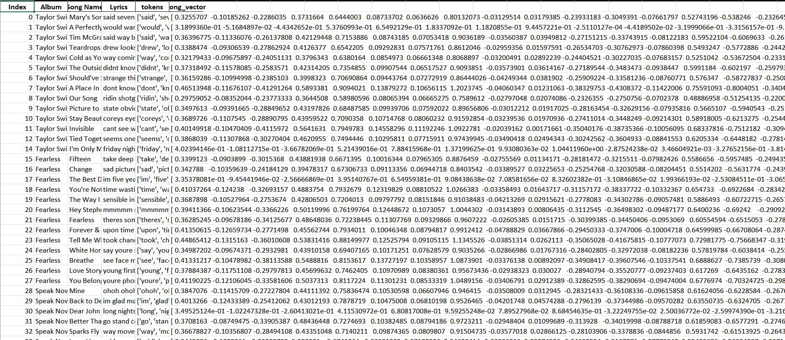
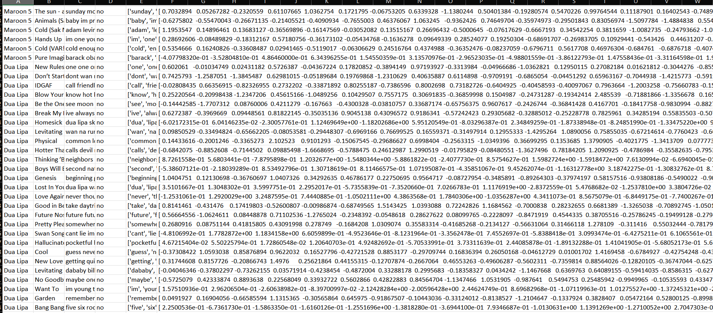
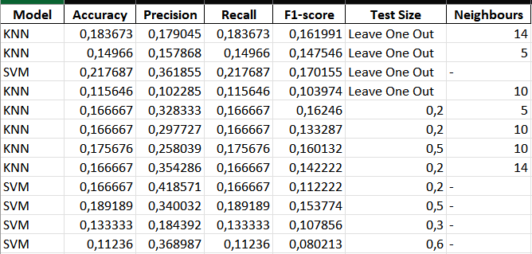
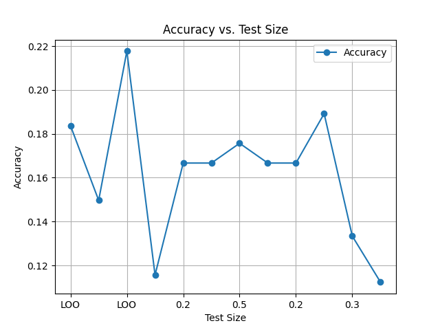
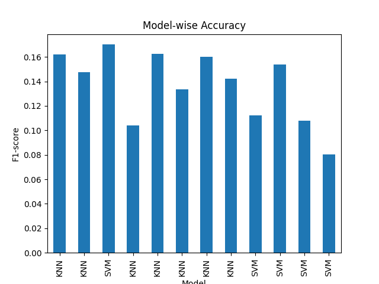

# Taylor Swift Song Album Classifier

/i.s3.glbimg.com/v1/AUTH_63b422c2caee4269b8b34177e8876b93/internal_photos/bs/2023/O/B/pBmpraTpusPFuQzb5gqw/399856954.jpg)

This project is a very simple machine learning model that classifies Taylor Swift songs into their respective albums based on their lyrics or predict yes if belongs to TS or not. The ideia was not to reinvent the wheel, was simply to to create a fun and educational project for fans of Taylor Swift and also learn some basic of the NLP and Machine Learning.

Disclaimer: The .py files have the same structure and the code is pretty much the same (datasets, validation may change), but to leave in a single file would be very confusing and hard to read.

## How It Works

1. **Data Collection**: The lyrics data for Taylor Swift songs is collected from various sources.
2. **Data Preprocessing**: The lyrics are cleaned by converting them to lowercase, removing punctuation, and tokenizing them into words.
3. **Word Embeddings**: Word2Vec is used to create word embeddings for each song's lyrics, which are then aggregated to create a single vector representation for each song.
4. **Model Training**: The SVM (Support Vector Machine) model is trained using the song vectors and their corresponding album labels. (In the future I'll be adding KNN to test and compare)
5. **Model Evaluation**: The model is evaluated using accuracy, precision, recall, and F1-score metrics to measure its performance.
6. **Prediction**: Finally, the model is used to predict the album for each song in a test set.

## Setup Instructions

1. Clone this repository.
2. Install the required dependencies using `pip install -r requirements.txt`.
3. Run `python ml_album.py {knn or svm} {test_size} {k_neighbors}` to preprocess the data, train the model, and make predictions about the albums.
3. Run `python ml_album_loo.py {knn or svm} {k_neighbors}` to preprocess the data, train the model, and make predictions about the albums with Leave One Out validation.
4. Run `python ml_artist.py {knn or svm} {test_size}` to preprocess the data, train the model, and make predictions if the song is from Taylor Swift or not.
5. If no args are passed, the default values are: svm, 0.3, 5.
6. To plot the charts you can go into src/result.py and choose what charts you want, from which model and which dataset.

## Project Structure

- `src/preprocess`: This file contains the Python scripts for data preprocessing, including dataset creation, text cleaning and word embedding.
- `src/results.py`: This is responsible for storing the results of the models and plotting the charts.
- `src/ml_albums.py`: The main Python script for album classifier that contains the data preprocessing, model training, and evaluation code.
- `src/ml_artist.py`: The main Python script for artist classifier that contains the data preprocessing, model training, and evaluation code.
- `assets/taylor_swift_lyrics.xlsx`: The dataset containing Taylor Swift song lyrics and their corresponding album labels.
- `assets/combined_dataset.xlsx`: The dataset with lots of songs from different artists and the label if the song is from Taylor Swift or not.
- `assets/archive`: This directory contains the poluted original dataset with the lyrics of the songs. 
- `requirements.txt`: A list of Python packages required to run the project.

* ps: The created datasets after some preprocessing will also be in the assets folder.

## KNN vs SVM for Album Guesser

### Choice of Models

For the Album Guesser project, I compared the performance of K-Nearest Neighbors (KNN) and Support Vector Machine (SVM) models for classifying Taylor Swift songs into albums based on their lyrics. Both models were chosen for their suitability in classification tasks and ease of implementation.

### Datasets and Challenges

Here is as example of the dataset after being processed

The dataset consists of Taylor Swift songs and their lyrics, posing a challenging classification task due to the varied styles and themes within each album. Additionally, the dataset size is relatively small, which can impact the performance of complex models.

### KNN Outperformance without Leave One Out

KNN outperformed SVM when not using LOO in this project, likely due to the following reasons:

1. Feature Space: Word2Vec embeddings created a meaningful feature space where the concept of similarity between songs was well-defined. KNN, which relies on finding similarities with nearby points, could leverage this effectively.

2. Dataset Size: KNN performs well on smaller datasets, capturing local patterns effectively. The dataset size may have been better suited to KNN compared to SVM, which requires more data for complex decision boundaries.

3. Model Complexity: KNN is a non-parametric model that does not make strong assumptions about the underlying data distribution. This flexibility may have allowed it to capture the nuances of Taylor Swift's song lyrics more effectively.

4. Hyperparameters: The hyperparameters chosen for KNN, such as the number of neighbors, may have been more suitable for the dataset compared to those chosen for SVM

5. Class Imbalance: KNN can be more robust to class imbalance, which could have contributed to its better performance if certain albums had more songs than others.

* And then when applying LOO, SVM showed a interesting superior performance (abput .05 in accuracy and .1 in F1 score).

### Neural Network

Im starting a new aproach for this problem to try new results and learn new models

This uses a Sequential model with:
* Dense layer with 500 neurons and ReLU activation function
* Dropout layer with a rate of 0.2
* Dense layer with 300 neurons and ReLU activation function
* Dropout layer with a rate of 0.2
* Dense layer with 300 neurons and ReLU activation function
* Dropout layer with a rate of 0.2
* Dense layer with 150 neurons and ReLU activation function
* Dense output layer with a number of neurons equal to the number of classes in the target variable and a softmax activation function

The model is compiled with the Adam optimizer and the Sparse Categorical Crossentropy loss function. It also uses accuracy as a metric.

#### Training:

The model is trained for 50 epochs with a validation split of 0.2. Early stopping is used to stop training when the validation loss has not improved for 50 epochs. The best weights are restored at the end of training.

#### Prediction and Evaluation:

The model predicts the album for each song in the test set. The predictions are then converted from probabilities to class labels. The model's performance is evaluated using accuracy, which is printed at the end of the script.

#### Examples:
Accuracy: 23.333333432674408%
Actual: Reputation x Predicted: Reputation
Actual: folklore x Predicted: folklore
Actual: Taylor Swift x Predicted: Reputation
Actual: 1989 x Predicted: 1989
Actual: Lover x Predicted: folklore
Actual: folklore x Predicted: folklore
Actual: Midnights x Predicted: Reputation
Actual: Fearless x Predicted: Lover
Actual: Fearless x Predicted: Reputation
Actual: Lover x Predicted: Reputation
Actual: evermore x Predicted: folklore
Actual: Reputation x Predicted: Lover
Actual: 1989 x Predicted: Reputation
Actual: Speak Now x Predicted: folklore
Actual: 1989 x Predicted: evermore
Actual: Red x Predicted: Lover
Actual: Red x Predicted: 1989
Actual: Speak Now x Predicted: Reputation
Actual: Speak Now x Predicted: Lover
Actual: Lover x Predicted: Lover
Actual: Taylor Swift x Predicted: folklore
Actual: Taylor Swift x Predicted: folklore
Actual: evermore x Predicted: Lover
Actual: Lover x Predicted: folklore
Actual: folklore x Predicted: folklore
Actual: evermore x Predicted: folklore
Actual: Reputation x Predicted: Reputation
Actual: Red x Predicted: Reputation
Actual: Fearless x Predicted: Reputation
Actual: Midnights x Predicted: folklore

### Conclusion

The better performance of KNN over SVM highlights the importance of selecting the appropriate model and features for a given dataset. It demonstrates that simpler models like KNN can sometimes outperform more complex models like SVM, especially in cases where the dataset is small and the relationships between features are well-defined.

However when the LOO was used as validation, a different conclusion can be drawn. Maybe because the dataset is better used and SVM can capture the nuances of the lyrics better than KNN. Still the results ARE NOT very reliable, but when you have a small .2 accuracy and get a improvement of .05 by changing validation it is a considerable improvement.

Another interesting fact observed after reading Predicted x Real, is that some albums are way harder than other to creaate relations between the lyrics and the album. This showed song from some albums to never be predicted correctly.On the other hand some albums have lyrics with more specifics and the models could get around them better, eg album Fearless and Speak Now showes interesting results. And last but not least, the albums folklore and evermore (sister albums) seemed to be a single thing for the model, as they are very similiar, and the model had a hard time to distinguish them, for eg sometimes it was folckore and the real was evermore or vice versa.

## KNN vs SVM for Classifying if YES or NO TAYLOR SWIFT

### Choice of Models

I chose to keep the same initial models even to compare how they would performe in a slightly different task.

### Datasets and Challenges

Here is as example of the dataset after being combined, filtered and process

This time I have a much much bigger set of entries. The initial set was very poluted (still not perfect) and a big part of data cleaning was remove the songs with useless texts, trash entries, unreleased data, some keywords crashing the filter and stuff like that. After doing some cleaning the result dataset could perform better in the classification task.

### KNN Outperformance

This time the KNN slightly outperformed the SVM. The reasons are the same as the previous task, but in this case the dataset size was a big factor. The KNN is a non-parametric model that does not make strong assumptions about the underlying data distribution. This flexibility may have allowed it to capture the nuances of the songs lyrics more effectively.
The fact to play test the neighbors number was also a big factor in the performance of the KNN.

### Conclusion

Some results for the album prediction can be seen in the table below: 

A chart to comapare how test size affects the accuracy

A model wise related to the F1-score chart

The metrics showed to be more close to reality. In the previous project sometimes they seemed off and not very reliable. In this case doesnt make sense to use LOO.

Another very obvious and error inducing factor is that if the dataset has 1000 songs and 50 are from TS, the model will be very biased to say that the song is not from TS. This is a issue of class imbalance and its a challenge that should be addressed to ensure unbiased model predictions.

Overall, I was pretty satisfied with the results and the performance of the models but its very important to keep the biased of the dataset in mind, and  I intend to test new models in the future to see how they perform in this task.

## Future Improvements

- Try different machine learning models.
- Experiment with different word embedding techniques and improve dataset.

## Contributions

Contributions are welcome! If you have any ideas for improvements or new features, feel free to submit a pull request.

## Credits

This project was created by Marco Tulio. Special thanks to Vinicius Schiavon for help and to @adashofdata who provided the dataset. 

That's all for now folks! If you have any questions or suggestions, feel free to reach out to me. Thanks for reading! 🎵🎶

